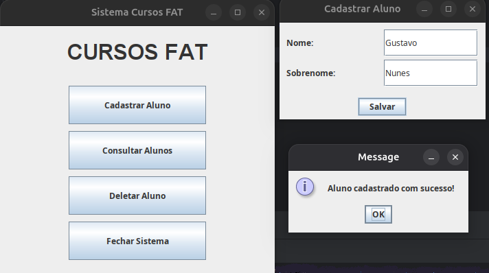
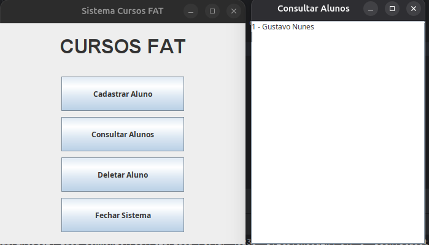
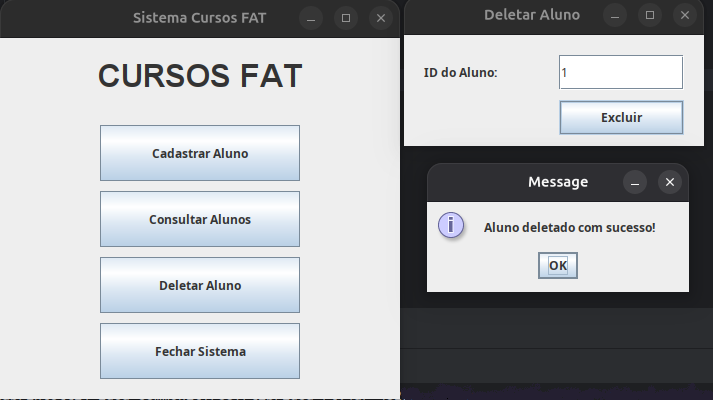
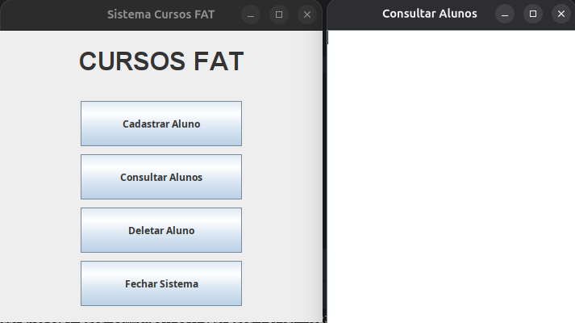

🧾 README.md – Projeto Final FAT (Cadastro de Alunos)

## 🎓 Projeto Final FAT - Sistema de Cadastro de Alunos


Sistema simples de cadastro de alunos utilizando **Java com Swing** e **MySQL**, desenvolvido para fins educacionais no contexto dos estudos com a plataforma **FAT**.

> 💡 Ideal para praticar a integração entre **Java Desktop (Swing)** e **banco de dados relacional** com conexão JDBC.

##  🖼️ Captura de Tela

- ### Abaixo está a tela de cadastro de alunos em ação:

<br><br>

- ### Abaixo está a tela de consulta de alunos em ação:

<br><br>

- ### Abaixo está a tela de consulta de alunos em ação:

<br><br>
<br><br>
---

## 🔧 Tecnologias Utilizadas

| Tecnologia | Versão |
|------------|--------|
| Java       | 8 ou superior |
| MySQL/MariaDB | 5.7+ ou superior |
| JDBC       | Integrado ao JDK |
| Swing      | GUI Toolkit |
| IntelliJ IDEA | Recomendado |
| XAMPP (Linux) | Para ambiente de testes com MySQL |

---

## 📂 Estrutura do Projeto

```
ProjetoFinalFat/
├── cursosfat/
│ ├── src/
│ │ └── main/
│ │ └── java/
│ │ └── com/
│ │ └── mycompany/
│ │ └── cursosfat/
│ │ ├── TelaCadastro.java
│ │ └── Conexao.java
│ └── README.md
```

## 📌 Funcionalidades

- [x] Interface gráfica para cadastro de alunos
- [x] Campos obrigatórios: nome e sobrenome
- [x] Conexão com banco de dados MySQL
- [x] Mensagens de sucesso e erro via JOptionPane
- [x] Limpeza automática dos campos após cadastro
- [x] Tratamento de erros de conexão e SQL

---

## 💾 Configuração do Banco de Dados

Execute os comandos abaixo no seu terminal ou no phpMyAdmin/XAMPP:

```sql
CREATE DATABASE IF NOT EXISTS FAT;

USE FAT;

CREATE TABLE IF NOT EXISTS Alunos (
    id INT AUTO_INCREMENT PRIMARY KEY,
    nome VARCHAR(100) NOT NULL,
    sobrenome VARCHAR(100) NOT NULL
);
```
## 🔌 Configuração de Conexão (classe Conexao.java)

```java
private static final String URL = "jdbc:mysql://localhost:3306/FAT";
private static final String USUARIO = "root";
private static final String SENHA = "";
Se estiver usando XAMPP no Linux, use o MySQL que já vem com o XAMPP e garanta que o serviço está ativo:
 ```
```
sudo /opt/lampp/lampp start
```
## 🚀 Como Executar no IntelliJ IDEA
Clone o repositório:

```
git clone https://github.com/seuusuario/ProjetoFinalFat.git
```
- Abra o projeto no IntelliJ IDEA
- Configure o SDK Java (Java 8 ou superior)
- Adicione o MySQL Connector/J no classpath:
- Vá em File → Project Structure → Libraries → Add .jar
- Use o mysql-connector-j-8.x.x.jar
- Compile e execute TelaCadastro.java

## ✅ Exemplo de uso
### Preencha os campos:

```
Nome:       Bruce  
Sobrenome:  Wayne
```
    - Clique em Salvar e veja: 
    - Aluno cadastrado com sucesso!


## 🧠 Aprendizados
- Uso de JTextField, JLabel, JButton e JPanel
- Layouts com BorderLayout e GridLayout
- Conexão JDBC com PreparedStatement
- Validação de campos e mensagens com JOptionPane
- Tratamento de SQLException
- Organização de projeto Java no padrão MVC simples

## 🔒 Observações
- A senha do MySQL foi deixada vazia por padrão ("") apenas para ambiente local de testes.
- NUNCA use essas credenciais em produção!
- Para subir o projeto no GitHub, exclua a pasta /out ou target.

🧙## 📄 Licença
Este projeto está sob a licença MIT.
Veja o arquivo LICENSE para mais detalhes.

Desenvolvedor em transição de carreira, apaixonado por tecnologia, qualidade de código e boas práticas. Sempre aprendendo, sempre evoluindo. 🚀

## 👤 Desenvolvido por
- [LinkedIn](https://www.linkedin.com/in/gustavo-nunnes) *(gustavo-nunnes)*
- Email: **gustavonunnes@hotmail.com**
- GitHub: [@GNunnes](https://github.com/GNunnes)
